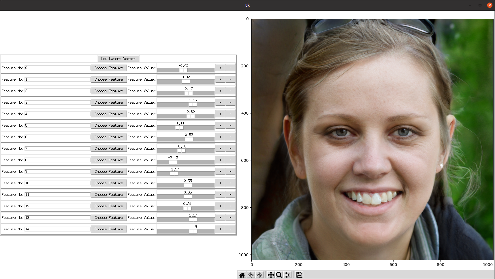

## StyleGAN2 visualizations


Visualize face images generated by StyleGAN2 and manipulate the latent space to observe the impact on the image.

The UI uses Tkinter, while the implementation of StyleGAN2 and the weights (trained on FFHQ) 
were taken from https://github.com/NVlabs/stylegan2-ada-pytorch



### How to run
Run the following command from the root of the repository:
```
python run.py
```

Possible arguments may include:
* _weights_path_: The path to the weights of StyleGAN2. Default is _./ffhq.pkl_.
* _sliders_no_: The number of sliders to be included in the UI. Default is 15.
* _gpu_: The GPU where StyleGAN2 is loaded. Default is 0.

Example:
```
python run.py --weights_path ./ffhq.pkl --gpu 0
```

If the weights are not downloaded in the path provided, they are downloaded from 
https://nvlabs-fi-cdn.nvidia.com/stylegan2-ada-pytorch/pretrained/.

### How to use

When the application is run, a random latent vector is generated and the corresponding image created 
by StyleGAN2.

The UI provides sliders that can be used to change the values of specific features of the latent space. 
There are also options to change the feature that each slider controls, and +/- buttons that change the values 
of the features by 0.01 steps.

To create a new latent vector and image, click the _Reset Latent Vector_ button.

### Requirements

* Pytorch >1.7.1
* Numpy
* Matplotlib
